# UD6 - Pràctica 2 - Documentem el codi amb JavaDoc

* [1. Modifica la classe `Calculadora.java`](#1-modifica-la-classe-calculadorajava)
* [2. **Documenta** el codi de la classe `Calculadora` usant comentaris `JavaDoc`:](#2-documenta-el-codi-de-la-classe-calculadora-usant-comentaris-javadoc)
* [3. **Genera** des d'**eclipse** la documentació **JavaDoc** del projecte.](#3-genera-des-declipse-la-documentació-javadoc-del-projecte)
* [4. Fes una captura del **codi font** documentat resultant de la classe `Calculadora`](#4-fes-una-captura-del-codi-font-documentat-resultant-de-la-classe-calculadora)
* [5. Mostra el **resultat** de la documentació:](#5-mostra-el-resultat-de-la-documentació)
* [6. Afegeix 3 **nous mètodes** a la classe calculadora](#6-afegeix-3-nous-mètodes-a-la-classe-calculadora)

Realitza un *fork* del projecte que es troba a: <https://github.com/arturocandela/2122ed-u6p2>. Una vegada realitzat, crea una nova branca que s'anomene **teunomcognom**  i comprova que pots executar-lo a **eclipse**. Una vegada ho tingues, realitza les tasques següents.

> Cada tasca ha d'estar com a mínim en un commit diferent i la branca **teunomcognom** ha de pujar-se al teu repositori nou creat.
> La entrega es farà adjuntant l'enllaç al repostori a l'activitat i adjuntant el pdf amb les captures demandes / text a l'activitat.

Realitza totes les captures necessàries per a indicar que has realitzat la tasca

## 1. Modifica la classe `Calculadora.java`

* Reanomena el paquet `ed.arturo` a `ed.<elteunom>`
>Para ello simplemente hacemos click derecho sobre el paquete y seleccionamos "Refactor" de ahi seleccionamos "Rename" y le cambiamos el nombre al nuevo

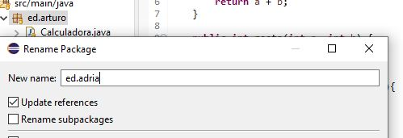

## 2. **Documenta** el codi de la classe `Calculadora` usant comentaris `JavaDoc`:

* Per a la **classe**:
  * Ha de tenir: una descripció curta que explique **clarament** per a què serveix esta classe. Afegeix en un altre paràgraf una descripció *més llarga*.
  * Afegeix els **tags** *JavaDoc* necessaris per a documentar:
    * L'**autor** ( posa el teu nom complet )
    * La **versió** actual de la classe ( 2.5 )
    * Que está **disponible des de** la versió 1.9, juny de 2019.
* Per a cadascun dels **mètodes** documenta:
  * **Descripció** explicant que fa el mètode.
  * **Paràmetres/s** amb la descripció més indicada.
  * Valor que **retorna** amb una descripció més indicada.
  * Si el métode llança una **exepció** ( error en execució), posa el tipus d'*exepció* i la descripció de la mateixa ( per exemple, el cas de la divisió per zero)

> Los comentarios de cada metodo con el de la clase se pueden ver en la actividad 6 mas abajo.

## 3. **Genera** des d'**eclipse** la documentació **JavaDoc** del projecte.

* Arregla els possibles **errors/warnings** que isquen. Fixa't en la descripció de l'error i torna a generar la documentació fins que vaja bé.
* Fes una captura de la **Consola**: ha de veure's tot el procés de generació complet.
* Fes una captura en la vista **Package Explorer** del directori **doc** resultant

> Revisa si la documentació s'ha afegit correctament a git, en cas contrari, revisa el fixter .gitignore. 

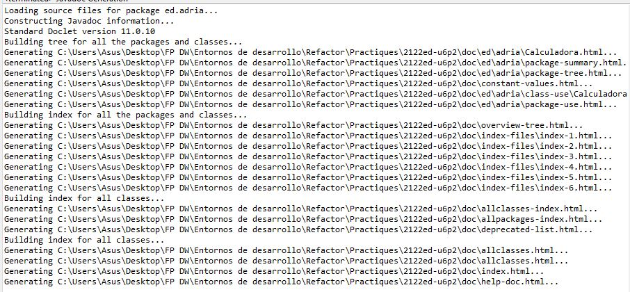

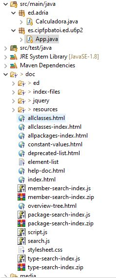

## 4. Fes una captura del **codi font** documentat resultant de la classe `Calculadora`

( En aquest cas, es possible que no siga necessari un commit)


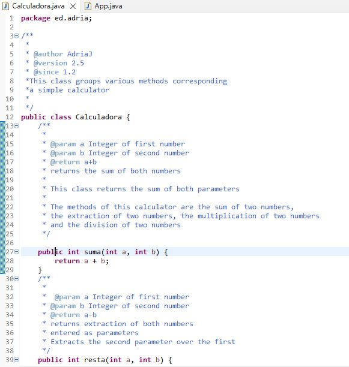


## 5. Mostra el **resultat** de la documentació: 

* Mostra el fitxer ***index.html*** en el **Navegador** integrat a **Eclipse** i mostra captures de **TOT** el seu contingut. Fixa't en la correspondència entre les descripcions i tags de les pàgines web ( *html*) generades.

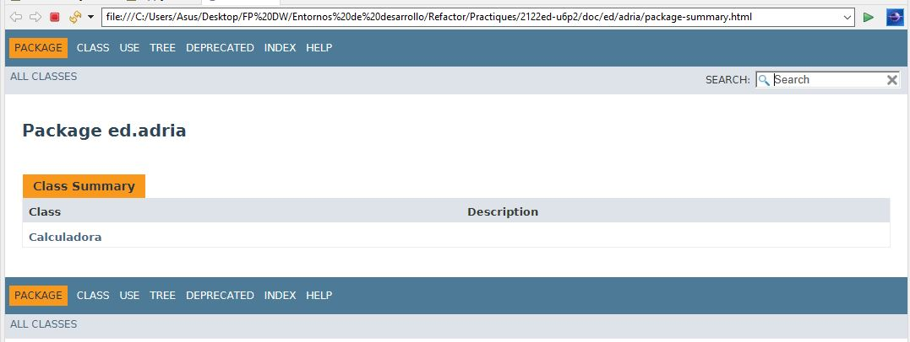


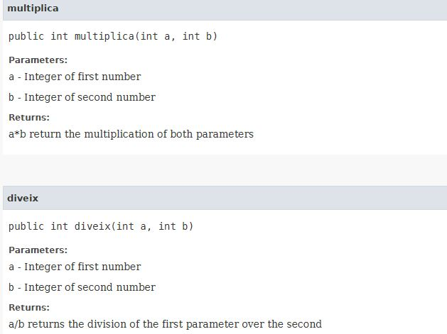


## 6. Afegeix 3 **nous mètodes** a la classe calculadora

```java

public int oper1 ( int a , int n ){

    int t = 1;

    for ( int i = 0; i < n ; i++ ){
        t = t * a;
    }

    return t; 

}

public boolean oper2 ( int a ){

    boolean r;

    if ( a % 2 == 0) {
        r = true;
    } else {
        r = false;
    }

    return r;

}

public String oper3(int a){

    String r = "";
    int v = a;
    int v1;

    while ( v > 0) {

        v1 = v % 2;

        r = v1 + r;

        v = v / 2;


    }

}

```

* **Investiga** quin càlcul realitza cadascun ( ajuda't del debugger).
* **Canvia** el nom dels mètodes i les seues variables per un nom més representatiu d'acord amb el seu funcionament (**Usa Refactoring -> Rename**)
* **Documenta** els nous mètodes adecuadament amb comentaris *JavaDoc*.
* **Genera** la documentació en *JavaDoc*
* Mostra **captures** de:
  * **codi documentat** ( fomateja el codi si hi cal)
  * directori doc i
  * la documentació resultant en el navegador
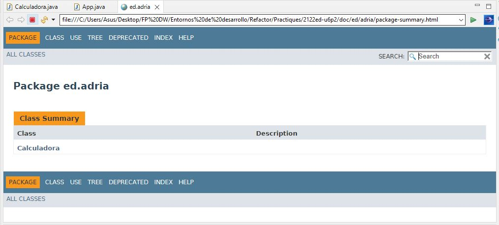
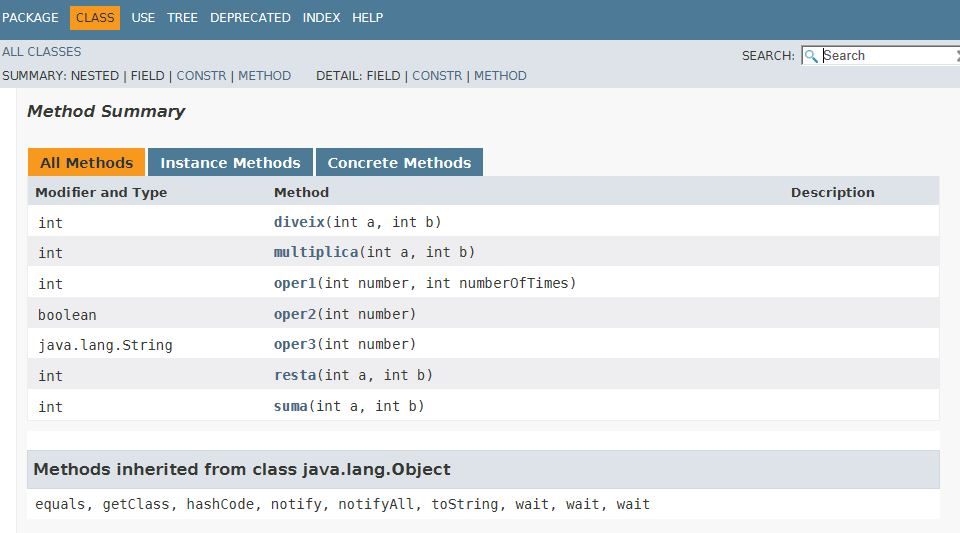
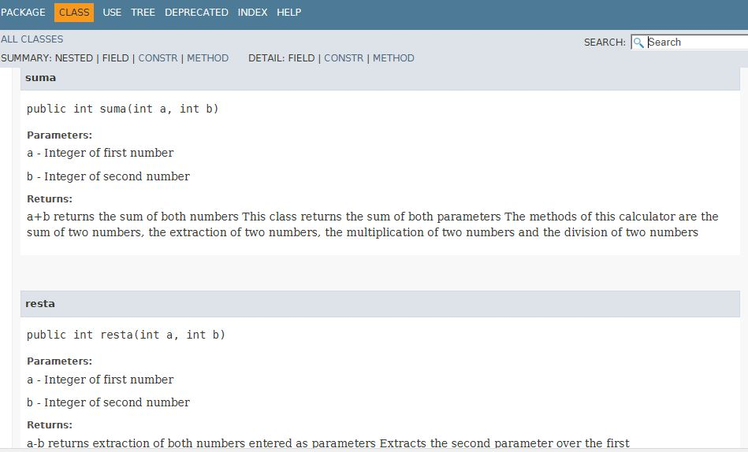
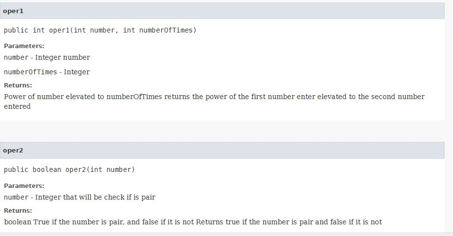
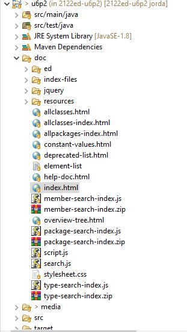

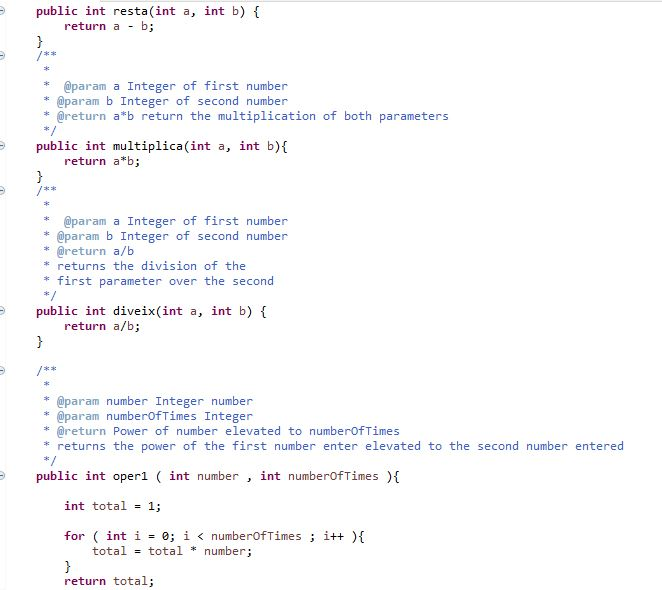

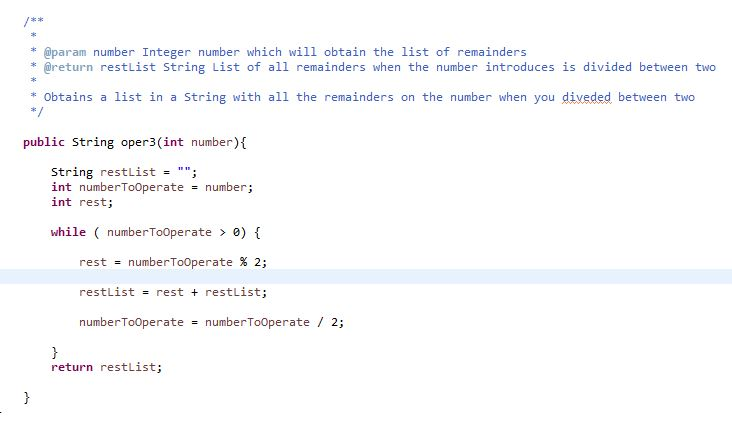

> Per a fer els commits a git, pot ser una bona estratègia realitzar-los per parts, es a dir, primer el codi, després el codi formatejat, després el codi documentat, etc.
